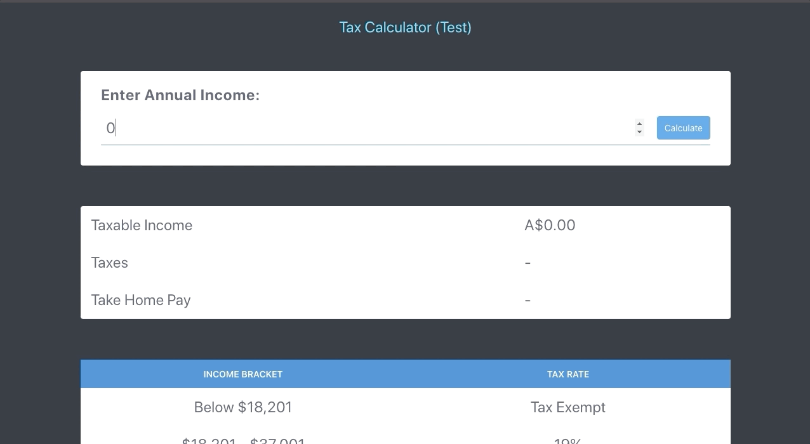

<div align="center">
  <p>
    <h3>React Tax Calculator </h2>
  </p>
  <p>
    <i>Income tax calculator react app. 🧾💵</i>
  </p>
</div>

---

[](https://wakatime.com/badge/github/NyashaNziramasanga/australia-tax-calculator)
[](https://app.netlify.com/sites/tax-calculator/deploys)
[](https://codeclimate.com/github/NyashaNziramasanga/tax-calculator/maintainability)




## Table of Contents

- [Table of Contents](#table-of-contents)
- [Getting Started](#getting-started)
- [Deployment](#deployment)
- [Contributing](#contributing)
- [Built With](#built-with)

## Getting Started

```bash
$ npm install
$ npm start
```

## Deployment

Netlify hosting on [tax-calculator.netlify.app](https://tax-calculator.netlify.app/)

## Contributing

Pull requests are welcome. For major changes, please open an issue first to discuss what you would like to change.

## Built With

- [React.js](https://reactjs.org/)
- [Tailwind-css](https://tailwindcss.com/)
- [Recoil (State Management)](https://recoiljs.org/)
